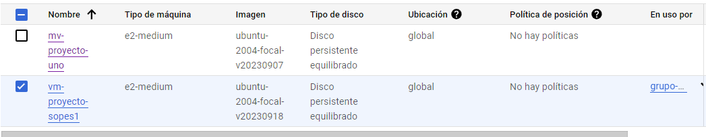

# SO1_PROYECTO1
## Victor Alejandro Cuches de Leon

### Modulos en /proc

#### Modulo CPU
``` sh
make all
sudo dmesg -C
sudo insmod cpu_201807307.ko
```
#### Modulo RAM
``` sh
make all
sudo dmesg -C
sudo insmod ram_201807307.ko
```

### Maquina virtual Monitoreo
- Frontend: Fue realizado con React, utilizando librerias de npm como MUI Material, bootstrap
- Backend: Fue realizado con Node, utilizando librerias de npm como express, cors y mysql
- Base de datos: Se utilizo un contenedor de docker mysql

### Maquina virtual Modulos
- Backend: Fue realizado con go, utilizando librerias como fiber


### Ejecutar maquinas virtuales 

#### Maquina virtual Monitoreo
``` docker
sudo docker compose up
```
Contenido de docker-compose

```
version: '3'

services:
  mysqldb:
    image: 'mysql'
    container_name: "database_container"
    environment:
      MYSQL_ROOT_PASSWORD: secret
      MYSQL_DATABASE: SOPES_P1
    volumes:
      - mysql-data:/var/lib/mysql
    ports:
      - 3307:3306  

  frontend:
    image: 'victorcuches28/proyecto_uno_frontend'
    container_name: "frontend_react"
    ports:
      - "3000:3000"
    depends_on:
      - backend

  backend:
    image: 'victorcuches28/proyecto_uno_node'
    container_name: "backend_node"
    depends_on:
      - mysqldb
    links:
      - mysqldb
    ports:
      - "5000:5000"


volumes:
  mysql-data:
```

#### Maquina virtual 
``` docker
sudo docker compose up
```
Contenido de docker-compose

```
version: '3'

services:
  backend_go:
    image: 'victorcuches28/proyecto_uno'
    container_name: "backend_go"
    volumes: 
      - type: bind
        source: /proc
        target: /proc
    pid: host
    restart: always
    ports:
      - "8080:8080"


  backend_py:
    image: 'victorcuches28/api_python'
    container_name: "backend_py"
    ports:
      - "6000:5000"

```

### Instancias y autoscaling


#### Plantilla de instancia



#### Grupo de instancias


### Imagenes en Docker 
